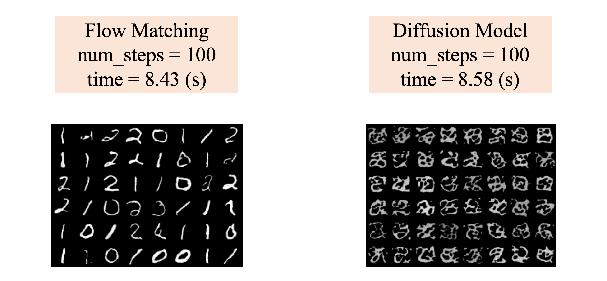

# Flow Matching Implementation for MNIST

This repository contains a simple implementation of **Flow Matching**, a generative model for sampling images, with the **UNet** architecture as the core model. The framework uses the **Euler sampler** and is trained on a subset of the MNIST dataset, specifically images of digits 0, 1, and 2.

## Key Components

- **Training and Sampling Process**: The diagram below illustrates the overall process of training and sampling in Flow Matching.
  

- **Image Visualizations**: The following visualization shows the results of generated samples at various timepoints from 0 to 1 second.
  

- **Flow Matching vs [Diffusion Models](https://github.com/duongngockhanh/denoising-diffusion-pytorch)**: Below are the comparisons between Flow Matching and Diffusion Models at different sampling steps:
  - **1000 steps**: 
    
  - **500 steps**: 
    
  - **100 steps**: 
    
  - **20 steps**: 
    

## Key Findings

Flow Matching, while not achieving the same image quality as Diffusion Models, demonstrates significantly faster sampling times. Even with only 20 sampling steps, Flow Matching is capable of generating meaningful samples, whereas Diffusion Models typically require at least 500 steps to produce coherent samples.

## Conclusion

- Flow Matching is an efficient alternative to Diffusion Models, offering faster sampling speeds.
- While it doesn't match Diffusion Models in sample quality, it still provides meaningful results with fewer sampling steps.

For a more detailed explanation of the method and the results, please refer to the visualizations and comparisons above.
